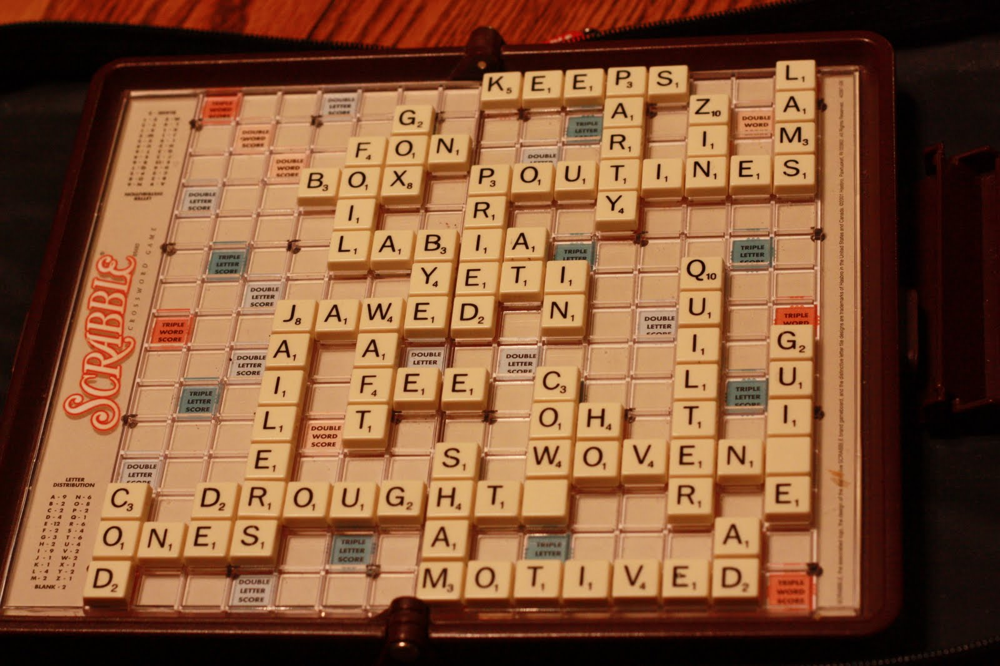

###########################
 Scrabble: Fun for Everyone
###########################

Why Scrabble?
================

Because it’s a board game that provides:

1. Enhancement of **vocabulary**
2. Improvement in **spelling**, **math**
3. **Quality**  **time** with family and friends

1. Enhancement of Vocabulary
==============================

**Vocabulary** is enhanced because:

a. Players learn new words from each other
b. At times dictionary is used to confirm certain words
c.  Pronunciation of words also comes into play

2. Improvement in Spelling, Math
================================

**Spelling** and **Math** improve as:

a. Players correct each other 
b. Players add and multiply over and over
c.  These skills are whole foundation of the game

3. Quality Time with Family and Friends
=======================================

Players enjoy **quality** **!!time** because it:

a. Brings all age groups together
b. Generates literacy related discussions
c. Can be played indoors/ outdoors
d. Can be played in all seasons
e. Multiple players can play

Additional Resource
=====================

Video on how to play scrabble:

http://scrabble.wonderhowto.com/how-to/play-classic-word-board-game-scrabble-173960/

Reference
=============

http://www.ehow.com/list_6710485_advantages-playing-scrabble.html

